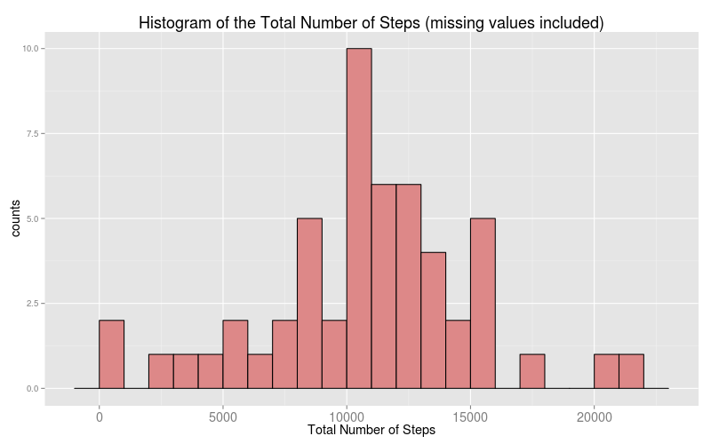
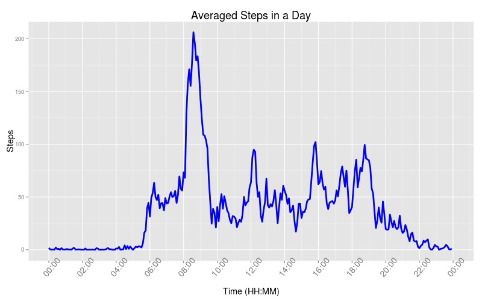
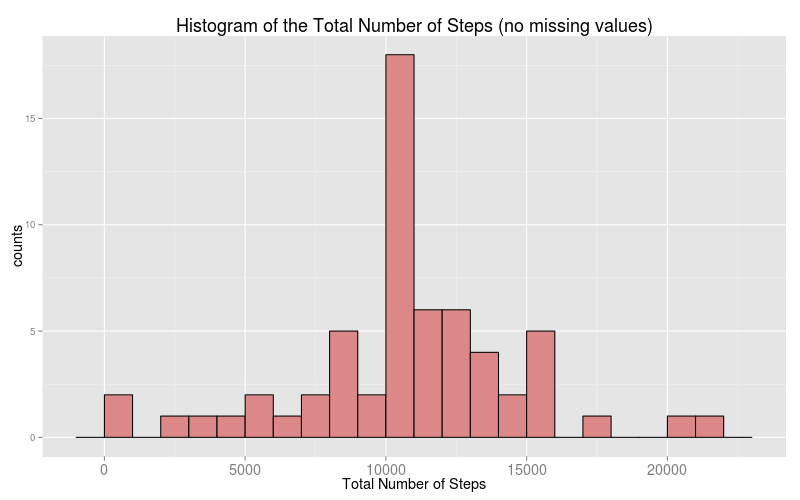
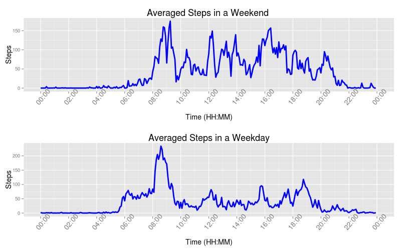

This report uses the data from a personal activity monitoring device that 
collects data every 5 minutes through out the day. 
The data in question includes the number of steps taken during the months of 
October and November, 2012. The raw data can be downloaded [here](https://d396qusza40orc.cloudfront.net/repdata%2Fdata%2Factivity.zip).

To start our analysis we proceed to load the data into R and convert the column 
specifying the dates when the data was taken into R date data type using the 
ymd() function from the "lubridate" library. A preview of the dataset is 
displayed below.

```r
#############    required libraries
library(lubridate)
#############    data is loaded into R
act_data <- read.csv("activity.csv", header = TRUE, stringsAsFactors = FALSE)
act_data$date <- ymd(act_data$date)
head(act_data)
```

```
##   steps       date interval
## 1    NA 2012-10-01        0
## 2    NA 2012-10-01        5
## 3    NA 2012-10-01       10
## 4    NA 2012-10-01       15
## 5    NA 2012-10-01       20
## 6    NA 2012-10-01       25
```
Using this dataset we want to address the following questions in this report:

* What is the total number of steps taken per day?
* What is the daily activity pattern?
* Are there differences in activity patterns between weekdays and weekends?

### What is the mean total number of steps taken per day?

To answer this question we can create an auxiliary dataframe containing the
total number of steps per day by using the ddply() function 
from the "plyr" library. Next, we create a histogram using the ggplot2 graphics 
package. 


```r
#############    required libraries
library(plyr)
library(ggplot2)
library(scales)
library(Rmisc)
library(chron)
#############    the intermediate dataframe is created
daily_steps <- ddply(act_data,"date",summarize,total_steps=sum(steps)) 
#############    graph is generated in ggplot
graph1 <- ggplot(data=daily_steps, aes(x=total_steps) ) + 
    geom_histogram (colour = "black", fill="#DD8888", binwidth = 1000) + 
    xlab("Total Number of Steps") + ylab ("counts") +
    ggtitle("Histogram of the Total Number of Steps (missing values included)") +
    theme(plot.title = element_text(size = rel(1.5))) + 
    theme(axis.text.x = element_text(size = rel(1.5))) + 
    theme(axis.title.x = element_text(size = rel(1.2))) + 
    theme(axis.title.y = element_text(size = rel(1.2)))
png("./Figures/histogram.png", width=800,height=500)
plot(graph1)
dev.off()
```

```
## png 
##   2
```

The mentioned graph and calculated mean and median total number of steps are
shown below.



```r
mean(daily_steps$total_steps, na.rm = TRUE)
```

```
## [1] 10766.19
```

```r
median(daily_steps$total_steps, na.rm = TRUE)
```

```
## [1] 10765
```

### What is the daily activity pattern?
To answer this question we generate a time series graph of the number of steps
averaged across all days. We do this by using the ddply() function from the 
"plyr"packageto. This creates an intermediate dataset with the average number of
steps per time interval. Then the intervals are converted into R data type 
objects. Because we wil use this part of code later we define a function that
does the job.


```r
####  the intermediate dataframe is generated
interval_steps <- ddply(act_data, "interval", summarize, 
                        mean_steps=mean(steps, na.rm = TRUE))
#### the intervals are converted to an R data type object
#### We define a custom function to use in the future that does this job
time_line_graph <- function(x_data){
    for (i in 1 : length(x_data$interval)) {
        digits <- nchar(as.character(x_data$interval[i]))
        elmnt <- x_data$interval[i]
        if (digits < 4) {
            zeros <- paste(replicate(4 - digits, "0"), collapse = "")
            x_data$interval[i] <- paste(zeros, as.character(elmnt), sep = "")
        } else {
            x_data$interval[i] <- as.character(elmnt)
        }
    } 
    strptime(x_data$interval , format="%H%M")
}
interval_steps$interval <- time_line_graph(interval_steps)
####   the graph is generated in ggplot
graph2 <- ggplot(data=interval_steps, aes(x=interval, y=mean_steps) ) + 
    geom_line(colour = "blue", size=rel(1.3)) + 
    xlab("Time (HH:MM)") + ylab ("Steps") +
    ggtitle("Averaged Steps in a Day") +
    theme(plot.title = element_text(size = rel(1.5))) + 
    theme(axis.text.x = element_text(angle = 50, size = rel(1.5))) + 
    theme(axis.title.x = element_text(size = rel(1.2))) + 
    theme(axis.title.y = element_text(size = rel(1.2))) +
scale_x_datetime(limits=c(as.POSIXct(paste(as.character(Sys.Date()), "00:00:00", sep = " ")), as.POSIXct(paste(as.character(Sys.Date() + 1), "00:00:00", sep = " ")) ), breaks=date_breaks("2 hour") ,label = date_format("%H:%M"))
png("./Figures/timeseries.png",width=800,height=500)
plot(graph2)
dev.off()
```

```
## png 
##   2
```


The previous graph shows a higher number of steps during the morning hours. 
Specifically,  the interval with the maximum number of steps is: 
    

```r
format(interval_steps$interval[interval_steps$mean_steps == max(interval_steps$mean_steps)], "%H:%M")
```

```
## [1] "08:35"
```

### Imputing Missing Values

In the previous calculations we just did not take into account the missing 
values. Now we will fill the missing values with the average values per day. 
First we want to know what is the total number of rows in the raw dataset that 
contain missing values.


```r
sum(is.na(act_data$steps))
```

```
## [1] 2304
```
Lets now take the intermediate dataset containing the total number of steps averaged per day and replace the missing values with the median number of steps per day.


```r
daily_steps$total_steps[is.na(daily_steps$total_steps)] <- 10765 
```

We want to generate the same histogram and recalculate the mean and median from 
the first part of the assignment with this new dataframe.


```r
graph3 <- ggplot(data=daily_steps, aes(x=total_steps) ) + 
    geom_histogram (colour = "black", fill="#DD8888", binwidth = 1000) + 
    xlab("Total Number of Steps") + ylab ("counts") +
    ggtitle("Histogram of the Total Number of Steps (no missing values)") +
    theme(plot.title = element_text(size = rel(1.5))) + 
    theme(axis.text.x = element_text(size = rel(1.5))) + 
    theme(axis.title.x = element_text(size = rel(1.2))) + 
    theme(axis.title.y = element_text(size = rel(1.2)))
png("./Figures/histogram2.png", width=800,height=500)
plot(graph3)
dev.off()
```

```
## png 
##   2
```

```r
mean(daily_steps$total_steps, na.rm = TRUE)
```

```
## [1] 10766.03
```

```r
median(daily_steps$total_steps, na.rm = TRUE)
```

```
## [1] 10765
```


By comparing the last output with the one in the first part of the assignment 
we can conclude that the strategy implemented to remove the missing values is 
good. The median value did not change at all while the mean value changed only 
a small fraction.

### Are there differences in activity patterns between weekdays and weekends?

To answer this question we introduce a new column in the dataframe that indicates 
if the date corresponds to a weekday or weekend. We do this with the function 
is.weekend() from the "chron" library. Once we have two dataframes analogous to 
the one created before but for the weekday and weekend we generate a graph with 
the corresponding timelines.


```r
act_data$weekday <- is.weekend(act_data$date)
weekend_data <- act_data[act_data$weekday==TRUE, 1:3]
weekday_data <- act_data[act_data$weekday==FALSE, 1:3]
interval_steps_weekday <- ddply(weekday_data, "interval", summarize, 
                                mean_steps=mean(steps, na.rm = TRUE))
interval_steps_weekend <- ddply(weekend_data, "interval", summarize, 
                                mean_steps=mean(steps, na.rm = TRUE))
interval_steps_weekend$interval<- time_line_graph(interval_steps_weekend)
interval_steps_weekday$interval<- time_line_graph(interval_steps_weekday)
#### the weekend graph is generated
p1<-ggplot(data=interval_steps_weekend, aes(x=interval, y=mean_steps) ) + 
    geom_line(colour = "blue", size=rel(1.3)) + 
    xlab("Time (HH:MM)") + ylab ("Steps") +
    ggtitle("Averaged Steps in a Weekend ") +
    theme(plot.title = element_text(size = rel(1.5))) + 
    theme(axis.text.x = element_text(angle = 50, size = rel(1.5))) + 
    theme(axis.title.x = element_text(size = rel(1.2))) + 
    theme(axis.title.y = element_text(size = rel(1.2))) +
scale_x_datetime(limits=c(as.POSIXct(paste(as.character(Sys.Date()), "00:00:00", sep = " ")), as.POSIXct(paste(as.character(Sys.Date() + 1), "00:00:00", sep = " ")) ), breaks=date_breaks("2 hour") ,label = date_format("%H:%M"))
#### the weekday grah is generated
p2 <- ggplot(data=interval_steps_weekday, aes(x=interval, y=mean_steps) ) + 
    geom_line(colour = "blue", size=rel(1.3)) + 
    xlab("Time (HH:MM)") + ylab ("Steps") +
    ggtitle("Averaged Steps in a Weekday") +
    theme(plot.title = element_text(size = rel(1.5))) + 
    theme(axis.text.x = element_text(angle = 50, size = rel(1.5))) + 
    theme(axis.title.x = element_text(size = rel(1.2))) + 
    theme(axis.title.y = element_text(size = rel(1.2))) +
scale_x_datetime(limits=c(as.POSIXct(paste(as.character(Sys.Date()), "00:00:00", sep = " ")), as.POSIXct(paste(as.character(Sys.Date() + 1), "00:00:00", sep = " ")) ), breaks=date_breaks("2 hour") ,label = date_format("%H:%M"))
#######  plot to pdf
png("./Figures/doublegraph.png", width=800,height=500)
multiplot(p1, p2)
dev.off()
```

```
## png 
##   2
```


From the previous graph we can conclude that there is a difference in the 
activity pattern corresponding to weekdays and weekends. The subject in question 
wakes up later on weekends and tends to be more active during the day. On the 
other hand the subject probably walks to his/her work and then he remains sat 
during weekdays. This explain the peak of activity around 8:35 in the morning of
weekdays.
